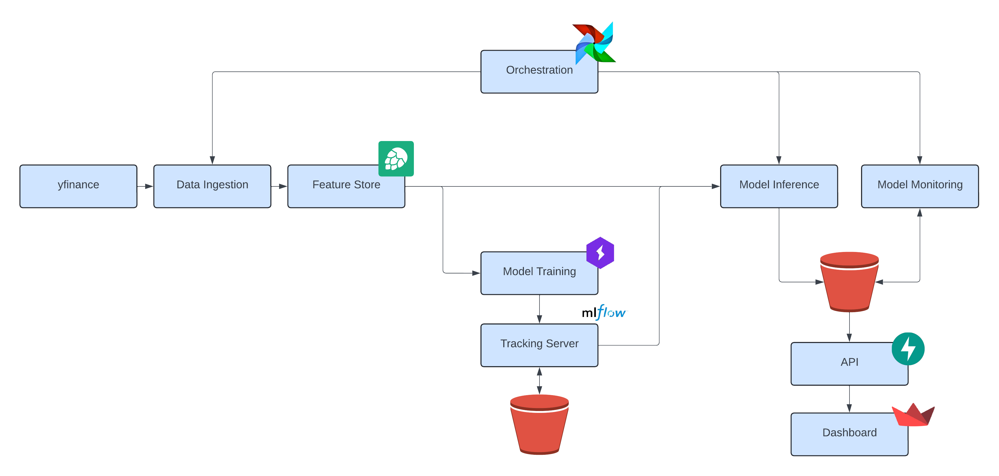
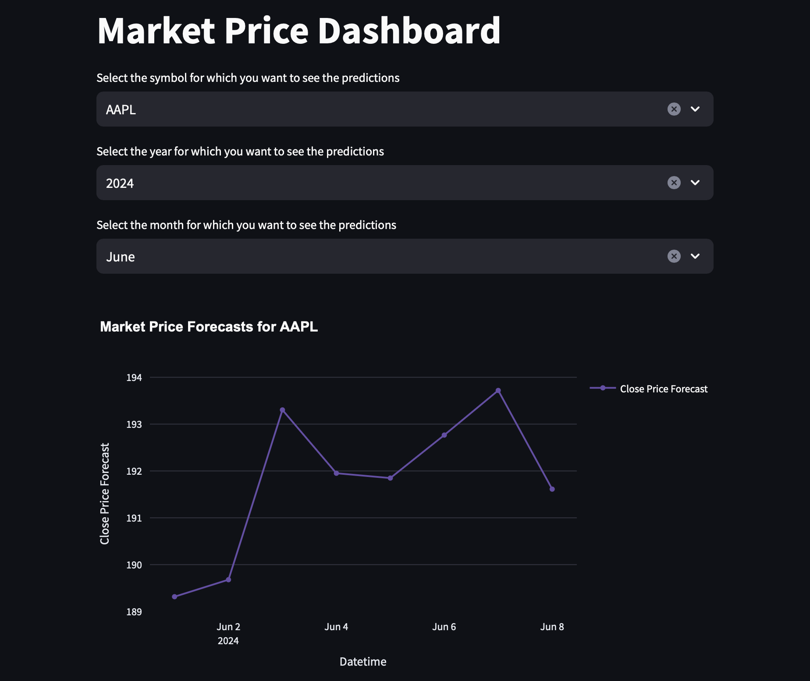

# Market Price Predictor

This project consists of a proof of concept application for predicting future (day-ahead) stock market closing prices. This can help investors make informed decisions and identify opportunities by providing an analysis on market trends. 

# Overall System



## Data Ingestion

Main components used here are the `Hopsworks` feature store and the `yfinance` package. `yfinance` serves as the initial data source, while `Hopsworks` stores data, both for training and for inference, and also allow for data versioning. 
In this stage, data is extracted, transformed, validated, and loaded in the feature store.

## Model Training

Main components used here are `Mlflow`, `Pytorch`, `Lightning`, `Sklearn`. `Pytorch` and `Lightning` are used to define and train a deep learning model. `Sklearn` is used for some feature engineering (scaling namely). `Mlflow` is used to log the experiments, allowing metric comparion between runs, and also storing critical artifacts such as the model file itself, as well as important pieces of code that allow it to run.
In this stage, we load data from the feature store, feature engineering steps are performed and a deep learning model is trained and logged.

## Model Inference

In this stage, a trained model is pulled from the `Mlflow` model registry, data is loaded from the feature store, predictions are made and stored in an `S3` bucket (using the `Boto3` package).

## Model Monitoring

In this stage, past predictions are loaded from `S3` and compared to data that is loaded from the feature store. The absolute error is calculated and stored in an `S3` bucket, similarly to the inference stage.

## Orchestration

Main component used here is `Airflow`. It is used to create a DAG with multiple tasks and specific tasks dependencies, as well as schedule it to run on a schedule.
In this stage, we define the dag and tasks, which include data ingestion, model inference and monitoring. The dag is run daily.

## API

Main component used here is `FastAPI`. It is used to create a fast and scalable API service with multiple endpoints. 
In this stage, we define endpoints to obtain predictions and the metrics obtained during the monitoring stage, which are pulled from the `S3` storage.

## Dashboard

Main component used here is `Streamlit`. It is used to create a simple data dashboard. Calls are made to the API to obtain both predictions and metrics on demand, which are then displayed.



# Guide

Pre-requisites: `Docker`, `Poetry`, `Python`

### Create .env files

In each folder, there will be a .env.default file that represents a template for the necessary environment variables. Run:

```shell
cp .env.default .env
```
in each folder and type the necessary variables that will be obtained by following the rest of the guide. 

### Setup Private PyPi Server

We will need to deploy some packages to be used as dependencies by `Airflow` later. For this end we can setup a private `PyPi` server.

Create credentials using `passlib`:
```shell
# Install dependencies.
sudo apt install -y apache2-utils
pip install passlib

# Create the credentials under the market-price-predictor name.
mkdir ~/.htpasswd
htpasswd -sc ~/.htpasswd/htpasswd.txt market-price-predictor
```

Set `poetry` to use the credentials:
```shell
poetry config repositories.my-pypi http://localhost
poetry config http-basic.my-pypi market-price-predictor <password>
```

### Hopsworks

`Hopsworks` is used as a serverless feature store, and as such you need to create an account and a project in `Hopsworks`. Choose a unique project name, obtain an API key and add these credentials to the .env files when required.


### AWS S3

We use AWS `S3` buckets to store predictions and metrics, as well as model artifacts for `Mlflow`. As such, you need to create a AWS account. After this step, you need to do 2 things:
- Create 2 `S3` buckets, one for model artifacts and one for model predictions and metrics. The names are up to you but they must be unique (you can follow [this](https://docs.aws.amazon.com/AmazonS3/latest/userguide/creating-bucket.html) guide)
- Create access keys (you can follow [this](https://docs.aws.amazon.com/IAM/latest/UserGuide/id_credentials_access-keys.html) guide)

Add the name of the buckets and the keys to the .env files.


### Run Airflow + Private PyPi + Mlflow Tracking Server

Move to the `orchestration` directory and run the following:
```shell
# Initialize the Airflow database
docker compose up airflow-init

# Start up all services
# Note: You should set up the private PyPi server credentials before running this command.
docker compose --env-file .env up --build -d
```

### Deploy the modules

In order to deploy the modules in the private `PyPi` server, simply move to the `deploy` directory and run:
```shell
# Build and deploy the modules.
sh deploy_modules.sh
```

### Login into Airflow

You can access the `Airflow` webserver using `localhost:8080`, and login using `airflow` as the username and password. First, configure the parameters that are necessary to run the pipelines. Go to the `Admin` tab, then hit `Variables`. Then you can click on the `blue` `+` button to add a new variable.
These are the parameters you can configure with example values:
- `ml_pipeline_symbols` = ["MSFT", "AAPL", "AMZN", "META", "GOOGL"]
- `ml_pipeline_interval` = "1d"
- `ml_pipeline_days_delay` = 14
- `ml_pipeline_feature_group_version` = 1
- `ml_pipeline_feature_view_version` = 1

Note that the `ml_pipeline_symbols` variable in particular needs to be consistent with a model for that particular symbol having been trained and deployed.

Finally, go to the `DAGs` tab and find the `ml_pipeline` dag. Toggle the activation button. You can also run the DAG manually by pressing the play button from the top-right side of the window.

### Run the Web App (API + Dashboard)

Go to the root directory of your project `market-price-predictor` and run the following docker command, which will build and run all the docker containers of the web app:
```shell
docker compose -f deploy/app_docker_compose.yaml --project-directory . up --build
```
You can access the `API` at `localhost:8001/api/v1/docs` and the `Dashboard` at `localhost:8501`


## Train models

### Download the data

Move to the `data_ingest` directory and run the following:
```shell
python pipeline.py --symbol SYMBOL --start_date START_DATE --end_date END_DATE

python feature_views.py --start_date START_DATE --end_date END_DATE
```
for the desired `SYMBOL` (e.g. AAPL for Apple, MSFT for Microsoft) and dates in the format `YYYY-MM-DD`.

### Train the model

Edit the configs in `model-training/configs` for the desired `SYMBOL`, date ranges, and other hyperparameters.

Move to the `model_training` directory and run the following:
```shell
python train.py
```

### Register the model

Access the `Mlflow UI` at `localhost:6500` and find the run that corresponds to the model you just trained. 

Press the `Register model` button at the top right. Create a new model with the format "market_price_predictor_symbol_{symbol}" replacing {symbol} for the desited `SYMBOL`.

Go to the `Models` page and add an alias `@champion` to the model you want to use in production. 

If you retrain a model for the same symbol, when registring the model, pick the already existing model name and simply add the alias to this new re-trained model.


# Future Improvements

- [ ] Add ECS deployment guide
- [ ] Add CI/CD pipeline
    - [ ] Add tests
    - [ ] Add IaC (e.g Terraform)
- [ ] Improve model performance
    - [ ] Incorporate news data + sentiment analysis
    - [ ] Train with higher resolution data
    - [ ] Data augmentation
    - [ ] Automatic hyperparameter tuning
- [ ] Automatic model retraining based on monitoring
- [ ] Consider changing to different data storage (e.g. Timescale)